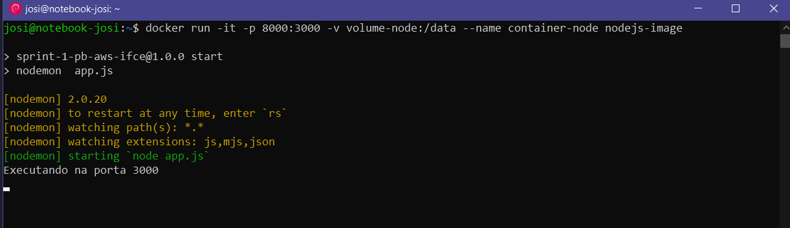

# Avaliação - Sprint 1
## Proposta
Criar um container Docker com node.js
## Implementação
Para este trabalho, foram seguidos os passos contidos em: <https://acervolima.com/docker-docker-container-para-node-js/>.

Inicialmente foi criado o arquivo app.js e nele é usado o framework _express_ para a construção do nosso exemplo. Também nele foi definido que a porta utilizada seria a 3000.
Em seguida é iniciado o projeto com `npm init`.

>Obs: Eu particularmente não instalei os recursos adicionais express e nodemon, mas os adicionei em _dependencies_ do arquivo _package.json_. 

Depois, foi criado o arquivo _Dockerfile_, que define o "processo" de criação da imagem, e no qual fica determinado a porta em que o container poderá ser acessado:
~~~
FROM node:latest
WORKDIR /app 
COPY package*.json .
RUN npm install
COPY . .
EXPOSE 3000
CMD ["npm","start"]
~~~

Nele pode-se ver que a imagem se 'baseia' na última versão da imagem do _node_. Também é importante destacar que a instrução __RUN__ vai executar o `npm install` dentro do container que for criado com essa nova imagem.  E por fim será executado a instrução passada em __CMD__: `npm start` que vai rodar a aplicação.

Em seguida foi criada a imagem conforme segue:

~~~
docker build -t nodejs-image .
~~~

Depois, o container foi iniciado com o comando:

~~~ 
docker run -it -p 8000:3000 -v volume-node:/data --name container-node nodejs-image
~~~

Obs.: O container foi executado com terminal interativo para ver o resultado do console.log(). A porta exterta definida foi a 8000, como no exemplo do site.

Este foi o resultado no terminal:

Este foi o resultado no navegador:

